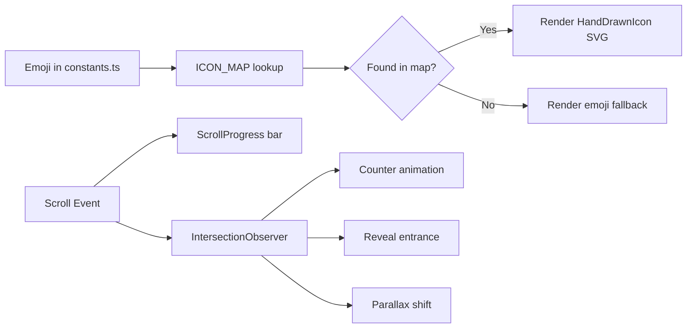

# Premium Polish Plan — Hand-Drawn Icons & Scroll Animations

## Overview

Three major upgrades to make the site feel human-crafted and premium:
1. **Replace all emoji icons** with hand-drawn SVG illustrations (already started in `HandDrawnIcons.tsx`)
2. **Add premium scroll animations** — parallax, staggered reveals, sticky elements, scroll-triggered counters
3. **Hero demo section parallax** — the phone mockup, floating chips, and orbs move at different speeds on scroll for a depth effect

---

## Part 1: Emoji → Hand-Drawn SVG Icon Replacement

### Current Emoji Usage Inventory

| Component | Emojis Used | Source File | Line |
|-----------|-------------|-------------|------|
| [`ProblemSolution.tsx`](lumenfly-next/components/ProblemSolution.tsx) | `📵`, `⏳`, `💬`, `📉`, `🤖`, `⚡`, `🔔`, `📊` | [`constants.ts`](lumenfly-next/lib/constants.ts) lines 55,60,65,70,80,85,90,95 |
| [`PremiumAddons.tsx`](lumenfly-next/components/PremiumAddons.tsx) | `🛡️`, `💳`, `👥`, `📢` | [`constants.ts`](lumenfly-next/lib/constants.ts) lines 125,132,141,149 |
| [`Industries.tsx`](lumenfly-next/components/Industries.tsx) | `💇`, `💆`, `💅`, `🏥`, `✂️`, `☕`, `🏨`, `✦` | [`constants.ts`](lumenfly-next/lib/constants.ts) lines 182-189 |
| [`TrustFlow.tsx`](lumenfly-next/components/TrustFlow.tsx) | `💬`, `📅`, `📱` | [`constants.ts`](lumenfly-next/lib/constants.ts) lines 165-167 |
| [`CustomSolutions.tsx`](lumenfly-next/components/CustomSolutions.tsx) | `🎯`, `⚙️`, `📈`, `🤝` | [`constants.ts`](lumenfly-next/lib/constants.ts) lines 251,257,263,268 |
| [`Contact.tsx`](lumenfly-next/components/Contact.tsx) | `✉️`, `👨‍💻`, `🌟` | [`constants.ts`](lumenfly-next/lib/constants.ts) lines 280-282 |
| [`Hero.tsx`](lumenfly-next/components/Hero.tsx) | `👋`, `💆`, `💅`, `💇`, `🙂` | Hardcoded in phone mockup |
| [`LeadCatcher.tsx`](lumenfly-next/components/LeadCatcher.tsx) | `👋`, `✅` | Hardcoded in phone mockup |
| [`About.tsx`](lumenfly-next/components/About.tsx) | `✦` | Hardcoded line 46 |

### Strategy

The [`HandDrawnIcons.tsx`](lumenfly-next/components/ui/HandDrawnIcons.tsx) file already exists with many icons. The approach is:

1. **Add missing icons** to `HandDrawnIcons.tsx` for emojis not yet covered
2. **Create an icon map** in `constants.ts` that maps emoji strings to icon component names
3. **Update components** to render SVG icons instead of emoji strings
4. **Keep WhatsApp mockup emojis** (`👋`, `✅`, `🙂`) — these are inside phone screens and look natural there

### Icons Already Created (in HandDrawnIcons.tsx)

| Icon Component | Maps To | Used In |
|----------------|---------|---------|
| `MissedCallIcon` | 📵 | ProblemSolution (without) |
| `OverwhelmedIcon` | ⏳ | ProblemSolution (without) |
| `ChaosIcon` | 💬 | ProblemSolution (without) |
| `CracksIcon` | 📉 | ProblemSolution (without) |
| `RobotIcon` | 🤖 | ProblemSolution (with) |
| `LightningIcon` | ⚡ | ProblemSolution (with) |
| `BellIcon` | 🔔 | ProblemSolution (with) |
| `GrowthIcon` | 📊 | ProblemSolution (with) |
| `ShieldIcon` | 🛡️ | PremiumAddons |
| `CalendarIcon` | 💳 | PremiumAddons |
| `UserIcon` | 👥 | PremiumAddons |
| `SparkleIcon` | 📢 | PremiumAddons |
| `SalonIcon` | 💇 | Industries |
| `SpaIcon` | 💆 | Industries |
| `NailIcon` | 💅 | Industries |
| `CafeIcon` | ☕ | Industries |
| `HotelIcon` | 🏨 | Industries |
| `ClinicIcon` | 🏥 | Industries |
| `BarberIcon` | ✂️ | Industries |
| `TargetIcon` | 🎯 | CustomSolutions |
| `GearIcon` | ⚙️ | CustomSolutions |
| `ChartIcon` | 📈 | CustomSolutions |
| `HandshakeIcon` | 🤝 | CustomSolutions |
| `MessageIcon` | 💬 | TrustFlow |
| `MailIcon` | ✉️ | Contact |
| `StarIcon` | ⭐ | Reviews |
| `CheckIcon` | ✓ | LeadCatcher features |
| `IndustryIcons` map | All industry emojis | Industries |

### Icons Still Needed

| Missing Icon | For Component | Suggested Component Name |
|--------------|---------------|------------------------|
| 📅 (Calendar) | TrustFlow node 2 | Already have `CalendarIcon` — reuse |
| 📱 (Phone) | TrustFlow node 3 | `PhoneIcon` — new |
| ✦ (Star/diamond) | About.tsx, Industries "Your Business" | `DiamondIcon` — new |
| 👨‍💻 (Tech/sales) | Contact method 2 | `TechIcon` — new |
| 🌟 (Star/client success) | Contact method 3 | Reuse `StarIcon` or create `ClientIcon` |

### Implementation Steps

#### Step 1: Add missing icons to HandDrawnIcons.tsx
- `PhoneIcon` — for TrustFlow 📱 node
- `DiamondIcon` — for About ✦ and Industries highlighted ✦
- `TechIcon` — for Contact 👨‍💻

#### Step 2: Create icon mapping in constants.ts
Add an `ICON_MAP` export that maps emoji strings to icon components.

#### Step 3: Update component rendering
For each component that renders `{icon}` as a string, change to render the mapped SVG component instead.

**Pattern for ProblemSolution.tsx, PremiumAddons.tsx, CustomSolutions.tsx:**
```tsx
// Before
<div className="...">{icon}</div>

// After
import { ICON_MAP } from "@/lib/constants";
const IconComponent = ICON_MAP[icon];
<div className="...">{IconComponent ? <IconComponent /> : icon}</div>
```

**Pattern for Industries.tsx:**
```tsx
// Before
<div className="...">{item.icon}</div>

// After
import { IndustryIcons } from "@/components/ui/HandDrawnIcons";
const IconComp = IndustryIcons[item.icon];
<div className="...">{IconComp ? <IconComp /> : item.icon}</div>
```

**Pattern for TrustFlow.tsx:**
```tsx
// Before
<span className={i === 2 ? "" : "text-white"}>{node.icon}</span>

// After
import { ICON_MAP } from "@/lib/constants";
const FlowIcon = ICON_MAP[node.icon];
<span className={i === 2 ? "" : "text-white"}>
  {FlowIcon ? <FlowIcon className="w-7 h-7" /> : node.icon}
</span>
```

---

## Part 2: Premium Scroll Animations

### Current Animation State
- Basic `reveal` class with `IntersectionObserver` — fades up on scroll
- `d1`-`d4` delay classes for staggered reveals
- `animate-float`, `animate-floatB` for floating elements
- `animate-bubble` for WhatsApp message bubbles
- `animate-shine` for arrow glow
- `animate-firefly` for the gold dot pulse
- `animate-wobble`, `animate-gentle-bounce`, `animate-sketch-in` (defined but not used)

### What to Add

#### 1. Parallax Floating Orbs (Hero)
Already have floating orbs in Hero. Enhance with:
- **Mouse-follow parallax** on the hero orbs (subtle — moves 5-10px based on cursor)
- **CSS-only**: Use `transform: translate()` with `@media (prefers-reduced-motion: no-preference)`

#### 2. Staggered Card Entrance (ProblemSolution, PremiumAddons, Industries, Reviews)
Already have `d1`-`d4` delays. Enhance with:
- **Scale entrance**: Cards scale from 0.95 → 1 while fading up
- **Directional entrance**: Cards alternate coming from left/right
- **Stagger children**: Each card in a grid enters with increasing delay

#### 3. Counter Animation (Hero KPIs)
The KPIs (`24/7`, `0s`, `100%`) should count up when scrolled into view.
- Use `useEffect` + `requestAnimationFrame` to animate from 0 → target
- Trigger when section enters viewport

#### 4. Sticky Section Titles
Section headers could use a subtle sticky effect:
- On desktop, the section header sticks briefly while content scrolls past
- Creates a "chapter" feel — premium editorial style

#### 5. Smooth Scroll Progress Indicator
- A thin gold line at the top of the page that fills as you scroll
- Shows reading progress — common on premium editorial sites

#### 6. Image/Visual Parallax (About, LeadCatcher)
- The dark visual card in About could have a subtle parallax shift
- The phone mockup in LeadCatcher could tilt slightly on scroll

#### 7. Scroll-Triggered Underline Reveal
- Section headlines get a gold underline that draws from left to right on scroll
- Use `clip-path` or `scaleX` animation triggered by IntersectionObserver

### Implementation Details

#### A. Scroll Progress Bar
Add to [`layout.tsx`](lumenfly-next/app/layout.tsx):
```tsx
// Client component: ScrollProgress.tsx
"use client";
export default function ScrollProgress() {
  const [progress, setProgress] = useState(0);
  useEffect(() => {
    const handleScroll = () => {
      const scrollTop = window.scrollY;
      const docHeight = document.documentElement.scrollHeight - window.innerHeight;
      setProgress(docHeight > 0 ? (scrollTop / docHeight) * 100 : 0);
    };
    window.addEventListener("scroll", handleScroll, { passive: true });
    return () => window.removeEventListener("scroll", handleScroll);
  }, []);
  return (
    <div className="fixed top-0 left-0 w-full h-[3px] z-[9999] bg-transparent">
      <div
        className="h-full bg-gradient-to-r from-[#C49400] to-[#F5C518] transition-all duration-150"
        style={{ width: `${progress}%` }}
      />
    </div>
  );
}
```

#### B. KPI Counter Animation
Add to [`Hero.tsx`](lumenfly-next/components/Hero.tsx):
```tsx
// Inside Hero component
const [counted, setCounted] = useState(false);
const kpiRef = useRef<HTMLDivElement>(null);

useEffect(() => {
  const observer = new IntersectionObserver(
    ([entry]) => {
      if (entry.isIntersecting && !counted) {
        setCounted(true);
        // Animate counters
      }
    },
    { threshold: 0.3 }
  );
  if (kpiRef.current) observer.observe(kpiRef.current);
  return () => observer.disconnect();
}, [counted]);
```

#### C. Parallax on About Visual Card
Add to [`About.tsx`](lumenfly-next/components/About.tsx):
```tsx
// Mouse parallax effect
const [offset, setOffset] = useState({ x: 0, y: 0 });
useEffect(() => {
  const handleMouse = (e: MouseEvent) => {
    const x = (e.clientX / window.innerWidth - 0.5) * 10;
    const y = (e.clientY / window.innerHeight - 0.5) * 10;
    setOffset({ x, y });
  };
  window.addEventListener("mousemove", handleMouse);
  return () => window.removeEventListener("mousemove", handleMouse);
}, []);
// Apply to card: style={{ transform: `translate(${offset.x}px, ${offset.y}px)` }}
```

#### D. Enhanced Section Reveal
Update [`globals.css`](lumenfly-next/app/globals.css):
```css
/* Add scale entrance variant */
.reveal-scale {
  opacity: 0;
  transform: translateY(26px) scale(0.95);
  transition: opacity 0.65s ease, transform 0.65s ease;
}
.reveal-scale.in {
  opacity: 1;
  transform: translateY(0) scale(1);
}

/* Directional entrance */
.reveal-left {
  opacity: 0;
  transform: translateX(-40px);
  transition: opacity 0.6s ease, transform 0.6s ease;
}
.reveal-left.in {
  opacity: 1;
  transform: translateX(0);
}
.reveal-right {
  opacity: 0;
  transform: translateX(40px);
  transition: opacity 0.6s ease, transform 0.6s ease;
}
.reveal-right.in {
  opacity: 1;
  transform: translateX(0);
}

/* Sticky section header */
.sticky-header {
  position: sticky;
  top: 80px;
  z-index: 5;
}
```

---

## Implementation Order

### Phase 1: Icon Replacement (higher priority — removes "AI-generated" feel)

| # | Task | Files to Modify |
|---|------|----------------|
| 1 | Add missing icons (`PhoneIcon`, `DiamondIcon`, `TechIcon`) | [`HandDrawnIcons.tsx`](lumenfly-next/components/ui/HandDrawnIcons.tsx) |
| 2 | Create `ICON_MAP` in constants.ts | [`constants.ts`](lumenfly-next/lib/constants.ts) |
| 3 | Update ProblemSolution.tsx to use SVG icons | [`ProblemSolution.tsx`](lumenfly-next/components/ProblemSolution.tsx) |
| 4 | Update PremiumAddons.tsx to use SVG icons | [`PremiumAddons.tsx`](lumenfly-next/components/PremiumAddons.tsx) |
| 5 | Update Industries.tsx to use `IndustryIcons` map | [`Industries.tsx`](lumenfly-next/components/Industries.tsx) |
| 6 | Update TrustFlow.tsx to use SVG icons | [`TrustFlow.tsx`](lumenfly-next/components/TrustFlow.tsx) |
| 7 | Update CustomSolutions.tsx to use SVG icons | [`CustomSolutions.tsx`](lumenfly-next/components/CustomSolutions.tsx) |
| 8 | Update Contact.tsx to use SVG icons | [`Contact.tsx`](lumenfly-next/components/Contact.tsx) |
| 9 | Update About.tsx ✦ to use `DiamondIcon` | [`About.tsx`](lumenfly-next/components/About.tsx) |
| 10 | Build test | `npm run build` |

### Phase 2: Scroll Animations (lower priority — polish layer)

| # | Task | Files to Modify |
|---|------|----------------|
| 11 | Create `ScrollProgress.tsx` component | New file: [`components/ui/ScrollProgress.tsx`](lumenfly-next/components/ui/ScrollProgress.tsx) |
| 12 | Add scroll progress bar to layout | [`layout.tsx`](lumenfly-next/app/layout.tsx) |
| 13 | Add KPI counter animation to Hero | [`Hero.tsx`](lumenfly-next/components/Hero.tsx) |
| 14 | Add enhanced reveal variants to globals.css | [`globals.css`](lumenfly-next/app/globals.css) |
| 15 | Add parallax effect to About visual card | [`About.tsx`](lumenfly-next/components/About.tsx) |
| 16 | Add mouse-follow parallax to Hero orbs | [`Hero.tsx`](lumenfly-next/components/Hero.tsx) |
| 17 | Build test | `npm run build` |

---

## Design Principles

1. **Subtlety over flash** — Animations should be felt, not noticed. 0.4s-0.7s durations, gentle easing.
2. **Performance first** — Use `transform` and `opacity` only (GPU-composited). No layout-triggering properties.
3. **Reduced motion** — All animations should respect `prefers-reduced-motion`.
4. **Mobile-friendly** — Parallax and mouse effects degrade gracefully on touch devices.
5. **Hand-drawn aesthetic** — SVG icons should have slightly imperfect curves, varied stroke widths, and warm gold/red tones matching the brand palette.

---

## Visual Reference


