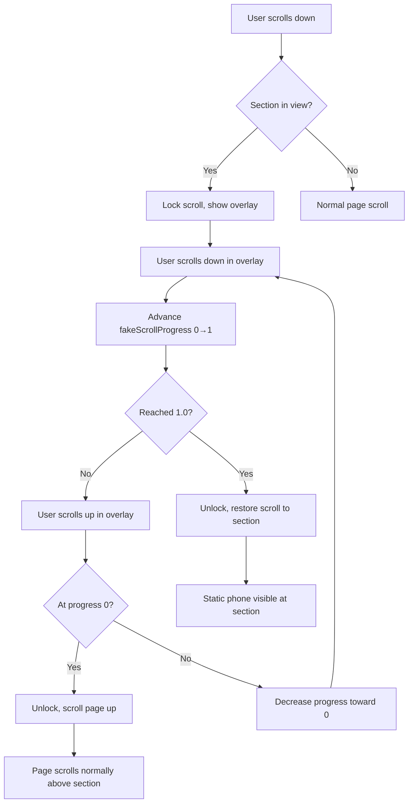

# Scroll-Lock Bug Fix Plan — LeadCatcher.tsx

## Bug 1: Scrolling Up Freezes the Page

### Root Cause
The wheel handler (line 165-183) only allows `fakeScrollProgress` to go **forward** (0 → 1). When the user scrolls **up** (negative `deltaY`), the accumulator subtracts, but `Math.max(0, ...)` clamps it to 0. However, the page remains **scroll-locked** (`overflow: hidden` on body) until `fakeScrollProgress >= 1`. So scrolling up does nothing visually — the page appears frozen because:
- `isLocked` stays `true`
- `overflow: hidden` prevents any real page scroll
- `fakeScrollProgress` is stuck at some value < 1
- The user can't scroll up to exit the overlay

### Fix: Allow Scrolling Up to Exit
When `fakeScrollProgress` reaches 0 **and** the user continues scrolling up (negative delta), unlock immediately and jump the real page scroll position to where the LeadCatcher section starts. This makes scrolling up feel natural — it exits the demo and scrolls the page up.

**Implementation:**
1. In the wheel handler (line 165-183), after clamping `fakeScrollProgress`:
   - If `fakeScrollProgress === 0` and the user scrolls up (sign < 0), unlock and scroll the page up
2. In the touch handler (line 198-215), same logic for touch swipe-down
3. On unlock via scroll-up: set `demoCompletedRef.current = true`, `setShowCompletedDemo(true)`, `setIsLocked(false)`, and `window.scrollTo(...)` to the section's original position

### Key Variables
- `lockScrollYRef.current` — stores the `window.scrollY` when lock was acquired
- `sectionRef.current` — the LeadCatcher section element

---

## Bug 2: After Parallax Completes, Page Jumps to Top Instead of Staying at the Section

### Root Cause
When `fakeScrollProgress >= 1`, the unlock effect (line 229-236) fires:
1. Sets `isLocked = false`
2. Removes `overflow: hidden` from body
3. But `document.body.style.top = "-{lockScrollYRef.current}px"` is cleared

The scroll-lock pattern uses `position: fixed` via `body.style.top = -scrollY`. When unlocked, the body's `top` is reset to `""`, but the browser's scroll position is still at `lockScrollYRef.current`. Since `history.scrollRestoration = "manual"` (line 96), the browser doesn't restore the scroll position — it stays wherever the body's `top` offset placed it, which is effectively **at the top of the page**.

### Fix: Restore Scroll Position After Unlock
After unlocking, explicitly call `window.scrollTo(0, lockScrollYRef.current)` to jump the page to where the LeadCatcher section is, so the static phone is visible.

**Implementation:**
In the unlock effect (line 229-236), after `setIsLocked(false)`, add:
```typescript
// Restore scroll position to where the section is
requestAnimationFrame(() => {
  window.scrollTo(0, lockScrollYRef.current);
});
```

---

## Summary of Changes Needed in LeadCatcher.tsx

### Change 1: Wheel handler — allow scroll-up to exit
**Location:** Lines 165-183
```typescript
const onWheel = (e: WheelEvent) => {
  e.preventDefault();
  scrollAccumulatorRef.current += e.deltaY;
  const threshold = 30;
  const steps = Math.floor(Math.abs(scrollAccumulatorRef.current) / threshold);
  if (steps === 0) return;

  const sign = scrollAccumulatorRef.current > 0 ? 1 : -1;
  scrollAccumulatorRef.current -= sign * steps * threshold;

  setFakeScrollProgress((prev) => {
    const delta = sign * steps * 0.01;
    const next = Math.max(0, Math.min(1, prev + delta));
    // If already at 0 and scrolling up, unlock and scroll page up
    if (next === 0 && sign < 0 && !demoCompletedRef.current) {
      demoCompletedRef.current = true;
      setShowCompletedDemo(true);
      setIsLocked(false);
      // Scroll page up past the section
      requestAnimationFrame(() => {
        window.scrollTo(0, Math.max(0, lockScrollYRef.current - window.innerHeight * 0.5));
      });
    }
    return next;
  });
};
```

### Change 2: Touch handler — allow swipe-down to exit
**Location:** Lines 198-215
Same logic but for touch: when `fakeScrollProgress` reaches 0 and user swipes down (sign < 0), unlock.

### Change 3: Unlock effect — restore scroll position
**Location:** Lines 229-236
```typescript
useEffect(() => {
  if (reducedMotion) return;
  if (isLocked && fakeScrollProgress >= 1) {
    demoCompletedRef.current = true;
    setShowCompletedDemo(true);
    setIsLocked(false);
    // Restore scroll position to where the section is
    requestAnimationFrame(() => {
      window.scrollTo(0, lockScrollYRef.current);
    });
  }
}, [isLocked, fakeScrollProgress, reducedMotion]);
```

---

## Flow Diagram


