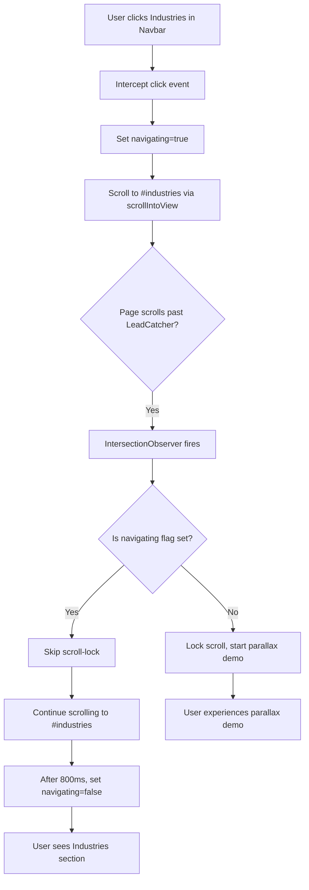

# Scroll Navigation Fix Plan — Navbar Link to Sections Below LeadCatcher

> **Note:** This plan was refined after implementation. The key insight is that `#plans` (LeadCatcher itself) should NOT be intercepted — the parallax demo should play when navigating to it. Only sections **below** LeadCatcher need the navigation flag.

## Bug Description

When the user is on the **first section (Hero)** of the website and clicks the **"Industries"** button in the navbar, the page attempts to scroll to `#industries` but **stops prematurely** at the **LeadCatcher section** (`#plans`). This happens because the LeadCatcher component has a scroll-lock/parallax feature that intercepts scrolling when the section enters the viewport.

## Root Cause Analysis

The page section order is:

```
Hero (#home) → ProblemSolution (#why) → LeadCatcher (#plans) → PremiumAddons (#addons) → Industries (#industries) → ...
```

When clicking "Industries" from the Hero section, the browser's native smooth scroll (`scroll-behavior: smooth` in [`app/globals.css:215`](app/globals.css:215)) starts scrolling toward `#industries`. However, as the page scrolls past the **LeadCatcher** section (`#plans`), the IntersectionObserver in [`LeadCatcher.tsx:122-134`](components/LeadCatcher.tsx:122) detects the section entering the viewport and **locks the scroll** (`setIsLocked(true)`), which:

1. Sets `overflow: hidden` on the body (via `.scroll-locked` class)
2. Fixes the body position with `position: fixed`
3. Prevents any further native scrolling

This means the smooth scroll to `#industries` gets **interrupted** because the scroll-lock mechanism hijacks the page.

## The Core Problem

The LeadCatcher's scroll-lock is designed for a **user-initiated scroll-down** experience (discovering the phone demo naturally). But when a **programmatic navigation** (clicking a navbar link) triggers a scroll to a section **below** LeadCatcher, the lock fires prematurely and blocks the navigation.

## Solution Options

### Option A: Disable Scroll-Lock During Programmatic Navigation (Recommended)

**Approach:** Before initiating any smooth scroll navigation to a section below LeadCatcher, temporarily disable the scroll-lock mechanism. After the scroll completes, re-enable it.

**Implementation:**

1. Create a global state or event system that signals "programmatic navigation in progress"
2. In [`LeadCatcher.tsx`](components/LeadCatcher.tsx), check this flag before activating the scroll-lock
3. After the navigation scroll completes, clear the flag

**Changes needed:**

#### 1. Create a scroll-navigation context/event system

Add a simple event-based system or React context to communicate between Navbar and LeadCatcher.

#### 2. Modify [`Navbar.tsx`](components/Navbar.tsx) — intercept link clicks

Instead of using native `<a href="#industries">` (which triggers browser smooth scroll), intercept clicks, set a "navigation lock" flag, then use `element.scrollIntoView()` or `window.scrollTo()` with `behavior: "smooth"`.

#### 3. Modify [`LeadCatcher.tsx`](components/LeadCatcher.tsx) — respect navigation flag

In the IntersectionObserver callback (line 122-134), check if a programmatic navigation is in progress. If so, **do not lock** the scroll.

#### 4. Clear the flag after navigation completes

Use a `scroll` event listener or `setTimeout` to clear the navigation flag after the smooth scroll animation finishes (~500-800ms).

### Option B: Scroll to LeadCatcher First, Then Continue

**Approach:** When navigating to a section below LeadCatcher, first scroll to LeadCatcher's top, let the parallax demo play through quickly (or skip it), then continue to the target section.

**Complexity:** High — requires sequencing multiple scroll actions.

### Option C: Disable Scroll-Lock for Navbar Clicks Only

**Approach:** Add a `data-no-lock` attribute or URL parameter when navigating from the navbar. LeadCatcher checks for this and skips the lock.

**Implementation:**

1. In [`Navbar.tsx`](components/Navbar.tsx), append `?skip-lock` to the href or use a click handler
2. In [`LeadCatcher.tsx`](components/LeadCatcher.tsx), check for this signal and skip locking

**Downside:** URL-based approach is fragile; attribute-based requires coordination.

## Recommended Solution: Option A (Detailed)

### Step 1: Create a scroll navigation state mechanism

Add a simple module-level variable or React context that both Navbar and LeadCatcher can access.

**File:** [`lib/scroll-navigation.ts`](lib/scroll-navigation.ts) (new file)

```typescript
// Simple pub/sub for scroll navigation events
type Listener = (navigating: boolean) => void;
let isNavigating = false;
const listeners = new Set<Listener>();

export function setNavigating(navigating: boolean) {
  isNavigating = navigating;
  listeners.forEach((fn) => fn(navigating));
}

export function getNavigating(): boolean {
  return isNavigating;
}

export function onNavigatingChange(fn: Listener) {
  listeners.add(fn);
  return () => listeners.delete(fn);
}
```

### Step 2: Modify Navbar to intercept navigation clicks

In [`Navbar.tsx`](components/Navbar.tsx), replace the native `<a href="#industries">` with a click handler that:
1. Calls `setNavigating(true)`
2. Uses `document.querySelector(href)?.scrollIntoView({ behavior: "smooth" })`
3. After ~800ms (smooth scroll duration), calls `setNavigating(false)`

**Changes in [`Navbar.tsx`](components/Navbar.tsx):**

```tsx
// Add import
import { setNavigating } from "@/lib/scroll-navigation";

// In the component, add a click handler for nav links
const handleNavClick = (e: React.MouseEvent<HTMLAnchorElement>, href: string) => {
  // Only intercept hash links (same-page navigation)
  if (href.startsWith("#")) {
    e.preventDefault();
    const target = document.querySelector(href);
    if (target) {
      setNavigating(true);
      target.scrollIntoView({ behavior: "smooth" });
      // Clear the navigating flag after smooth scroll completes
      setTimeout(() => setNavigating(false), 800);
    }
  }
};
```

Apply this to both desktop nav links (line 52-58) and mobile nav links (line 113-122).

### Step 3: Modify LeadCatcher to respect navigation state

In [`LeadCatcher.tsx`](components/LeadCatcher.tsx), in the IntersectionObserver callback (line 122-134), add a check:

```tsx
// Add import
import { getNavigating } from "@/lib/scroll-navigation";

// In the observer callback (line 124):
if (entry.isIntersecting && !isLocked && !demoCompletedRef.current && !getNavigating()) {
  lockScrollYRef.current = window.scrollY;
  setIsLocked(true);
}
```

### Step 4: Also handle the wheel/touch handlers

When a programmatic navigation is in progress and the user hasn't triggered the lock, the wheel/touch handlers won't be active (since `isLocked` is false). This is fine — the page scrolls normally.

### Step 5: Handle the case where LeadCatcher was already locked

If the user was already in the LeadCatcher parallax demo and then clicks "Industries" in the navbar, we need to:
1. Unlock the scroll immediately
2. Then scroll to the target section

This can be handled by the same `setNavigating(true)` call — add an effect in LeadCatcher that listens for navigation state changes:

```tsx
useEffect(() => {
  const unsub = onNavigatingChange((navigating) => {
    if (navigating && isLocked) {
      // Force unlock
      demoCompletedRef.current = true;
      setShowCompletedDemo(true);
      setIsLocked(false);
    }
  });
  return unsub;
}, [isLocked]);
```

## Flow Diagram



## Alternative: Simpler Approach — Just Use `scroll-behavior: smooth` with `scroll-margin-top`

Before implementing the full solution, check if simply adding `scroll-margin-top` to the sections would help. The issue is that the LeadCatcher's scroll-lock fires before the target section is reached. A simpler fix might be:

1. Add `scroll-margin-top: 100vh` (or a large value) to the [`Industries`](components/Industries.tsx) section
2. This would make the browser scroll further past LeadCatcher before considering `#industries` "in view"

**However**, this won't work because the scroll-lock in LeadCatcher fires at `threshold: 0.15` (15% of the section visible), which happens well before the Industries section comes into view. The scroll-lock prevents any further scrolling, so `scroll-margin-top` can't help.

## Files to Modify

| File | Change |
|------|--------|
| [`lib/scroll-navigation.ts`](lib/scroll-navigation.ts) | **New** — Create navigation state pub/sub |
| [`components/Navbar.tsx`](components/Navbar.tsx) | Intercept nav link clicks, set navigating flag |
| [`components/LeadCatcher.tsx`](components/LeadCatcher.tsx) | Check navigating flag before locking; force unlock when navigating |
